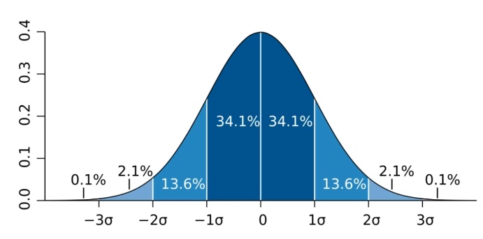
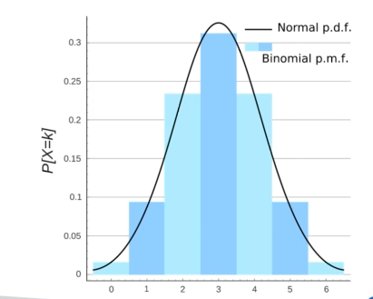
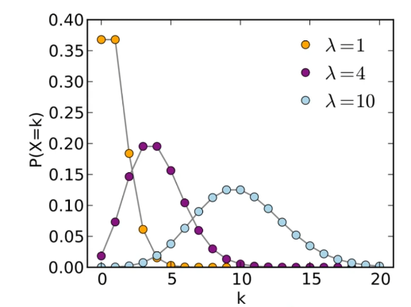
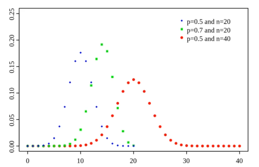

# Data Science Basics

## Types of Data

- The major types of data are:
    - Numerical
    - Categorical
    - Ordinal

### Numerical Data

- Represents some sort of quantitative measurement, for example: hights if people, page loads, stock prices, etc.
- There are 2 kinds of numerical data:
    - Discrete data: integer based, often counts of some events
    - Continuous data: infinite number of possible values

### Categorical Data

- Qualitative data that has no inherent mathematical meaning
- Examples: gender, yes/no (binary data), State of Residence, Product Category, etc.
- We can assign numbers to categories in order to represent them more compactly. These numbers don't have mathematical meaning

### Ordinal Data

- A mixture of numerical and categorical
- It is a categorical data that has mathematical meaning
- Examples: movie rating on a scale of 1-5

## Data Distributions

- Probability distribution function: gives us the probability of a data point falling within some given range of a given value
- Normal Distribution:

- Probability Mass Function: discrate distribution

- Poisson Distribution:

- Binomial Distribution:

## Time Series Analysis

- Series of data points over time
- Additive model: Seasonality + Trends + Noise = time series
- Multiplicative model: Seasonality * Trends * Noise = time series