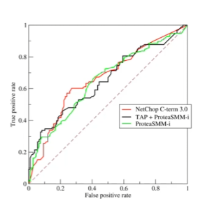

# Deep Learning

- Deep Learning frameworks:
    - Tensorflow / Keras
    - Apache MXNet

- Types of neural networks:
    - Feedforward Neural Network
    - Convolutional Neural Network (CNN):
        - Mainly used for 2D data, example image classification
    - Recurrent Neural Network (RNN):
        - Manly used for sequences in time or for things which have an order for them, example stock prediction, understand words of sentences, translation
        - Flavors of RNN: LSTM, GRU

## Activation Functions

- It is a function inside of a given neuron, that sums up the all the inputs and decides what output should be sent to the next layer of neurons
- Types of activation functions:
    - Linear: 
        - It doesn't really "do" anything, it outputs the input data
        - Can't do backpropagation
        - There is no point in having more than one layer of liner activation functions
    - Binary Step function:
        - It's an ON/OFF function
        - It can't handle multiple classification - it is a binary function
        - Vertical slopes don't work well with calculus (derivate is infinite)
    - Non-Linear activation functions:
        - They can create complex mappings between input and outputs
        - They allow backpropagation (they have useful derivatives)
        - They allow to have multiple layers
- Non-linear activation functions:
    - Sigmoid or Logistic / TanH (hyperbolic tangent):
        - They are nice and smooth
        - Sigmoid will scale the input between 0 to 1, TanH will scale the input between -1 to 1. They change slowly for high or low values ("Vanishing Gradient")
        - They are computationally expensive
        - Tanh is generally preferred over sigmoid
    - Rectified Linear Unit (ReLU):
        - Very popular choice for activation function
        - Very easy and fast to compute
        - In case the input are zero or negative, we have a linear function and all of its problems ("Dying ReLU problem")
    - Leaky ReLU:
        - Solves the "Dying ReLU problem" by introducing a negative slope bellow 0
    - Parametric ReLU (PReLU):
        - ReLU, but the slope is the negative part is learned via backpropagation
        - Complicated and computationally intensive
    - Other ReLU variants:
        - Exponential Linear Unit  (ELU)
        - Swish
            - From Google, performs really well
            - Performs well mostly with very deep networks (40+ layers)
        - Maxout
            - Output the max of the inputs
            - Technically ReLU is a special case of maxout
            - Doubles the parameters that need to be trained, not often practical
    - Softmax:
        - Used on the final output layer of a multiple classification problem
        - Basically converts outputs to probabilities of each classification
        - Can't produce more than one label for something (sigmoid can)
- Choosing an activation function:
    - For multiple classification, we should use softmax on the output layer
    - RNNs do well with Tanh
    - For everything else
        - Start with ReLU
        - If we need to do better, we should try Leaky ReLU
        - Last resort: PReLU, Maxout
        - Swish for really deep networks

## Convolutional Neural Networks (CNN)

- They are used mostly for image analysis
- Recommended when we have data that doesn't neatly align into columns. Examples:
    - Images that we want to find features within
    - Machine translation
    - Sentence classification
    - Sentiment analysis
- They can find features that aren't in a specific spot, examples:
    - Stop sing in a picture
    - Words within a sentences
- They are "feature-location invariant"
- How dod they work:
    - Local receptive fields are groups of neurons that only respond to a part of what is seen (subsampling)
    - They over overlap each other to cover the entire visual field  (convolution)
    - They feed into higher layers that identify increasing complex images
    - For color images we can used extra layers for red, green, and blue channels
- Building a CNN with Keras:
    - Source data must be of appropriate dimensions
    - Conv2D layer types does the actual convolution on a 2D image
    - MaxPooling2D layers can be used to reduce a 2D layer down by taking the maximum value in a given block
    - Flatten layers will convert the 2D layer to a 1D layer for passing into a flat hidden layer of neurons
    - Typical usage:
        - Conv2D -> MaxPooling -> Dropout -> Flatten -> Dense -> Dropout -> Softmax
- CNNs are very computationally intensive (CPU, GPU, adn RAM)
- CNNs have a lot of hyperparameters to configure (kernel sizes, layers with different number of units, amount of pooling, etc.)
- They are specialized architectures of CNNs:
    - LeNet-5: handwriting recognition
    - AlexNet: image classification
    - GoogLeNet: deeper than AlexNet, introduces inception modules (groups of convolutional layers)
    - ResNet (Residual Network): even deeper - maintains performance via skip connections

## Recurrent Neural Networks (RNNs)

- They are used for:
    - Time-series data:
        - Predict future behavior based on past behavior
        - Analyze web logs, sensor logs, stock trades
        - Self-driving based on past trajectories
    - Data that consists of sequences of arbitrary lengths:
        - Machine translation
        - Produce image captions
        - Produce machine-generated music
- RNN topologies:
    - Sequence to sequence: predict stock prices based on series of historical data
    - Sequence to vector: words in a sentence to sentiment
    - Vector to sequence: create captions from an image
    - Encodes -> Decoder: machine translation
- Training RNNs:
    - We need to backpropagate not only through the layers of the network but also through time
    - All these time steps adds up fast. To avoid this we can limit the number of time steps (truncated backpropagation through time)
    - The state from an earlier time step gets diluted over time. This can be a problem if the older behavior does not matter less than the newer (example: sentence of words). To counteract this effect we can do the following:
        - LSTM Cell:
            - Long Short-Term Memory Cell
            - Maintains a separate short-term and long-term state
        - GRU Cell:
            - Gated Recurrent Unit
            - Simplified LSTM Cell that performs similarly
- Training an RNN is hard:
    - They are very sensitive to topologies and choice of hyperparameters
    - Training is very resource intensive
    - A wrong choice can lead to RNN that doesn't converge at all

## Modern Natural Language Processing

- Transform deep learning architectures:
    - Adopts mechanism of "self-attention":
        - Weights significance of each part of the input data
        - Processes sequential data but processes the entire input at once
        - The attention mechanism provides context, so no need to process one word at a time
    - Models: BERT, RoBERTa, T5, GPT-2/3/4, DistilBERT
        - DistilBERT: uses knowledge distillation to reduce model size by 40%
        - BERT: Bi-directional Encoder Representation from Transformers
        - GPT: Generative Pre-Trained Transformer
- Transfer Learning - take pre-trained models and use them for own purposes
    - NLP models (and others) are too big and complex to build from scratch and re-train every time
    - Model zoos such as Hugging Face offer pre-trained models to start from
        - Hugging has an integration with Sagemaker via Hugging Face Deep Learning Containers
    - We can fine-tune these models for our own use cases
    - Transfer Learning approaches:
        - Continue training a pre-trained model - fine-tuning: use a low learning rate to ensure we are just incrementally improving the model
        - Add new trainable layers to the top of a frozen model: turn old features into predictions of new data
        - Retrain from scratch - in case we have a large amount of data and compute capacity
        - Use it as-is

## Deep Learning on EC2/EMR

- EMR supports Apache MXNet and GPU instance types
- Appropriate instance types for deep learning:
    - P3: 8 Tesla V100 GPUs
    - P2: 16 K80 GPUs (less expensive)
    - G3: 4 M60 GPUs (all Nvidia chips)
    - G5g: AWS Graviton 2 processors / Nvidia T4G Tensor GPUs
    - P4d: A100 "UltraClusters" for supercomputing
- Deep Learning AMIs

## Tuning Neural Networks

- Neural networks are trained by gradient descent (or similar means)
- We start at some random point and sample different solutions (weights) seeking to minimize some cost function over many epochs
- Learning rate: how far apart the samples are
- Effects of learning rate:
    - If the learning rate is too high, we can overshoot the optimal solution
    - If the learning rate is too small, it will take too long to find the optimal solution
    - Learning rate is an example of hyperparameter
- Batch size - how many training samples are used within each batch of each epoch
- Somewhat counter-intuitively:
    - Smaller batch sizes can work their way out of a "local minima" more easily
    - Batch sizes that are too large can end up getting stuck in the wrong solution
    - Random shuffling at each epoch can make this look like very inconsistent results from run to run

## Regularization

- It is a technique to prevent overfitting
- Overfitting happens when:
    - Models that are good at making prediction on the data they were trained on but non on new data 
    - Overfitted models have learned patterns in the training data that don't generalize to the real world
    - Often seen as high accuracy on training data set, but lower accuracy on test or evaluation data set
- Regularization techniques are intended to prevent overfitting:
    - Reduce the network size
    - Dropout: randomly drop out neurons at each epoch of the training
    - Early stopping: detect validation accuracy leveling and stop the training
- L1 and L2 regularization:
    - A regularization term is added as weights are learned
    - L1 term is the sum of the weights
    - L2 term is the sum of the square of the weights
    - L1:
        - Performs feature selection. Can cause entire features to go to 0
        - It is computationally inefficient
        - Produces sparse outputs
    - L2:
        - All features remain considered, just weighted
        - It is computationally efficient
        - Produces dense output
- Why would we want to use L1?
    - Feature selection can reduce dimensionality. The resulting sparsity can make up for its computational inefficiency
    - If all features are important, L2 is probably a better choice

## Gradient Problems

- The vanishing gradient problem:
    - When the slope of the learning curve approaches to zero, things can get stuck
    - We end up working with very small numbers that can slow down training or even introduce numerical errors
    - It can become a problem with deeper networks and RNNs as these vanishing gradients propagate to deeper layers
    - It is the opposite to the "exploding gradients" problem
- Fixing the vanishing gradient problem:
    - Multi-level hierarchy: break up levels into their own sub-networks trained individually
    - Long short-term memory (LSTM)
    - Residual Network
        - Example: ResNet
    - Better choice of activation function (ReLU is a good choice usually)
- Gradient Checking:
    - It is a debugging technique
    - Numerically check the derivatives computed during training
    - It is useful for validating the code of a neural network training

## Confusion Matrix

- A confusion matrix can help understand the more nuanced results of a model
- Binary confusion matrix:

|               | Actual YES      | Actual NO       |
|---------------|-----------------|-----------------|
| Predicted YES | TRUE POSITIVES  | FALSE POSITIVES |
| Predicted NO  | FALSE NEGATIVES | TRUE NEGATIVES  |

- Measuring models:
    - Recall: **TRUE POSITIVES / TRUE POSITIVES + FALSE NEGATIVES**
        - AKA Sensitivity, True Positive rate, Completeness
        - It is the percent of positive rightly predicted
        - It is a good choice when we care about the false negatives, ex. fraud detection
    - Precision: **TRUE POSITIVES / TRUE POSITIVES + FALSE POSITIVES**
        - AKA Correct Positives
        - It is the percent of relevant results
        - It is a good choice when we care about false positives, ex. medical screening, drug testing
    - Other metrics:
        - Specificity: **TRUE NEGATIVES / TRUE NEGATIVES + FALSE POSITIVES** (True negative rate)
        - F1 score: 
            - **2 * TRUE POSITIVES / 2 * TRUE POSITIVES + FALSE POSITIVES + FALSE NEGATIVES**
            - **2 * (Precision * Recall) / (Precision + Recall)**
            - It is the harmonic mean of precision and sensitivity
            - Good choice when we care about precision and recall
        - RMSE - Root mean squared error
            - It is used for accuracy measurement
            - It only cares about right and wrong answers
- ROC Curve - Receiver Operating Characteristic Curve
    - It is a plot of true positive rate (recall) vs. false positive rate at various threshold settings

    

    - Points above the diagonal represent good classification (better than random)
    - The idea curve would be a point in the upper-left corner
    - The more it's "bent" towards upper-left, the better
    - AUC: the area under ROC curve - Area Under the Curve
        - Equal to probability that a classifier will rank a randomly chosen positive instance higher than a randomly chosen negative instance
        - ROC AUC of 0.5 is useless classifier, 1.0 is perfect
        - Commonly used metric for comparing classifiers

## Ensemble Learning

- Common example: random forest
    - Decision trees are prone to overfitting => make lots of decision trees and let them all vote on the result
- Bagging:
    - Generate N new training sets by random sampling with replacement
    - Each resampled model can be trained in parallel
- Boosting:
    - Observations are weighted
    - Training is sequential, each classifier takes into account the previous one's success
- Bagging vs Boosting:
    - XGBoost is the latest hotness
    - Boosting generally yields better accuracy
    - Bagging avoids overfitting
    - Bagging is easier to parallelize