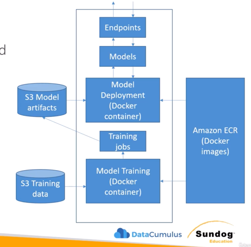
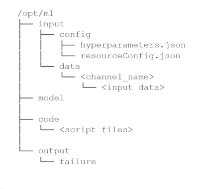
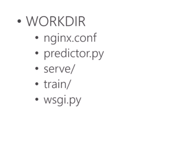

# SageMaker's Inner Details and Production Variants

## SageMaker + Docker

- All models in SageMaker are hosted in Docker containers registered with ECR
- Examples:
    - Pre-built deep learning model sitting in a Docker container
    - Pre-built SparkML or scikit-learn model in a Docker container
    - Pre-built Tensorflow, MXNet, Chainer, PyTorch frameworks. Tensorflow does not get distributed across multiple machines automatically. If we have to do distributed training, we can use a couple of things, such as Horovod framework or Parameter Servers
    - Our own training and inference code; extend pre-built images

## Using Docker

- Docker containers are created from images
- Images are built from Dockerfile
- Images are saved in a repository (ECR)

- Structure of a training/deployment container:

- `code` folder: the Python/other script to be executed
- `model`: used for deployment container, the inference code location

- Structure of the entire Docker image:

- `nginx.conf`: configuration for nginx frontend
- `predictor.py`: Flask webserver for making the predictions at runtime
- `server`: `gunicorn` server, runs multiple instances of the Flask application
- `train`: see structure of the training image
- `wsgi.py`: invoke Flask application

- Environment variables:
    - `SAGEMAKER_PROGRAM`: the name of the script inside `/opt/ml/code`
    - `SAGEMAKER_TRAINING_MODULE`
    - `SAGEMAKER_SERVICE_MODULE`
    - `SM_MODEL_DIR` : checkpoints
    - `SM_HPS`: hyper parameters

## Production Variants

- We can test out multiple models on live traffic using Production Variants (essentially A/B testing)
- Variant Weights can tell SageMaker how to distribute traffic among production variants
